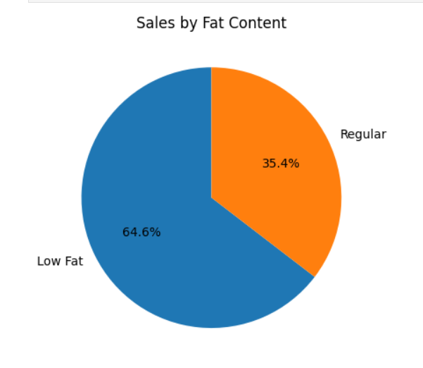
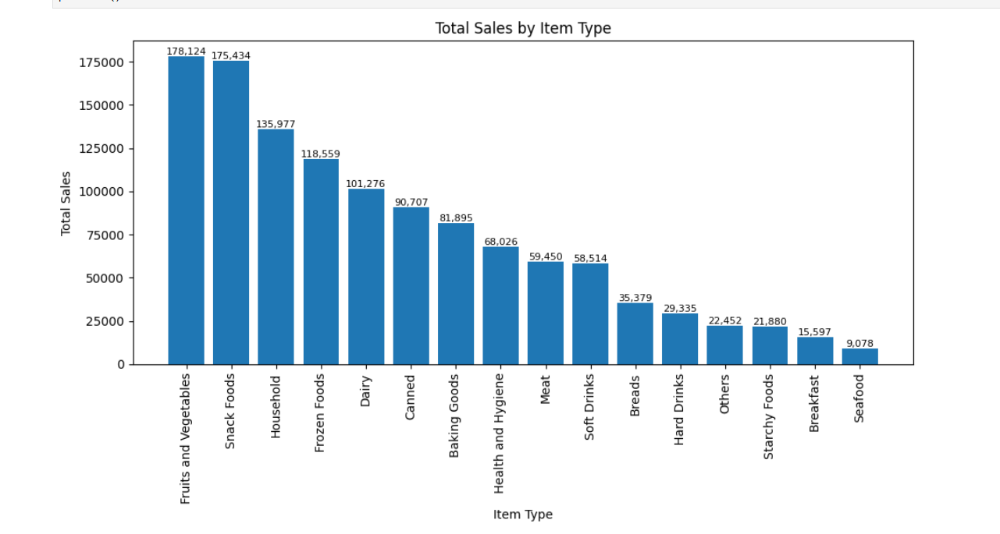
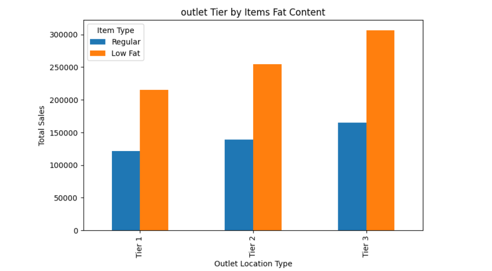
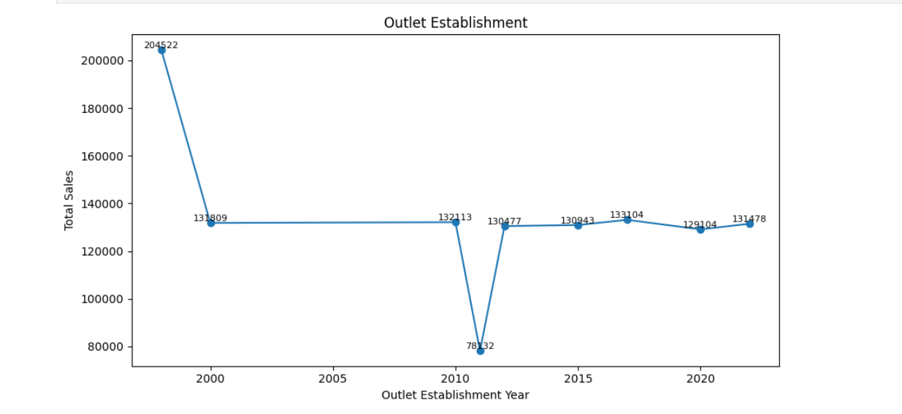
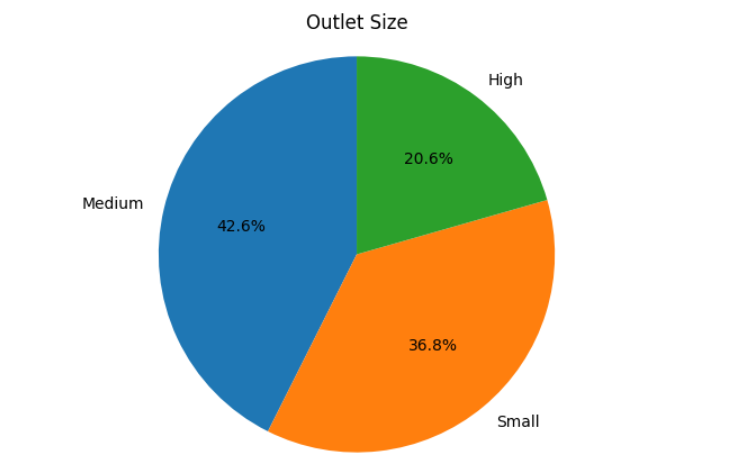
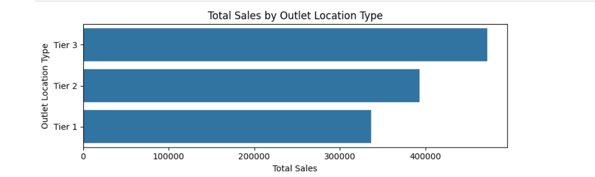

# Blinkit Sales Data Analysis 📊

A complete Exploratory Data Analysis (EDA) project on Blinkit grocery sales data using Python and data visualization libraries.  
This project focuses on analyzing sales performance, outlet trends, customer preferences, and product distribution using real-world retail data.

---

## 📌 Project Overview

The objective of this project is to extract meaningful business insights from Blinkit sales data through data cleaning, preprocessing, KPI analysis, and visualization techniques.

Key areas analyzed in this project:

- Total Sales Performance
- Sales by Item Type
- Outlet Establishment Trends
- Outlet Size Distribution
- Sales by Outlet Location Type
- Fat Content Distribution
- Customer Rating Analysis

---

## 🛠️ Technologies Used

- Python
- Pandas
- NumPy
- Matplotlib
- Seaborn
- Jupyter Notebook

---

## 📂 Project Structure

```bash
Blinkit-Sales-Analysis/
│
├── blinkit_analysis.ipynb
├── blinkit_data.csv
├── README.md
├── requirements.txt
└── images/
```

---

## 📈 KPIs Analyzed

The following KPIs were calculated and analyzed:

- Total Sales
- Average Sales
- Average Rating
- Number of Items Sold

---

## 📊 Sample Visualizations

### Sales by Fat Content


---

### Sales by Item Type


---

### Outlet Tier by Fat Content


---

### Outlet Establishment Trend


---

### Outlet Size Distribution


---

### Sales by Outlet Location


---

## 🧹 Data Cleaning & Preprocessing

Standardized inconsistent values in the dataset before analysis.

```python
df['Item Fat Content'] = df['Item Fat Content'].replace({
    'LF': 'Low Fat',
    'low fat': 'Low Fat',
    'reg': 'Regular'
})
```

---

## 📦 Requirements

Install the required libraries using:

```bash
pip install -r requirements.txt
```

### requirements.txt

```txt
pandas
numpy
matplotlib
seaborn
jupyter
```

---

## 🚀 Future Improvements

Potential future enhancements for this project:

- Interactive dashboards using Plotly or Power BI
- Machine Learning based sales prediction
- Streamlit web app deployment
- Advanced statistical analysis
- Correlation heatmaps and trend forecasting

---

## 👩‍💻 Author

**Risika Singh**

---

## ⭐ Support

If you found this project useful, consider giving it a star ⭐ on GitHub.
